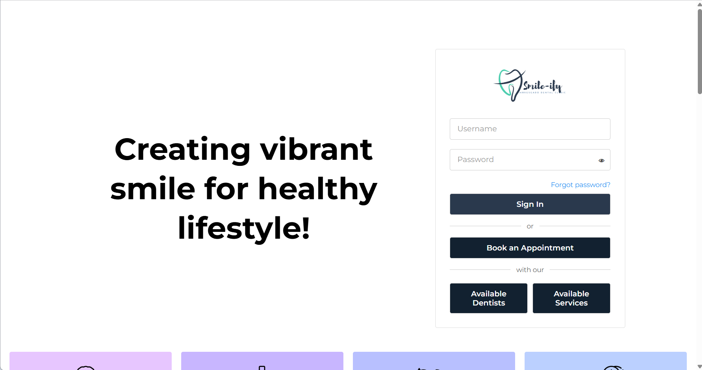
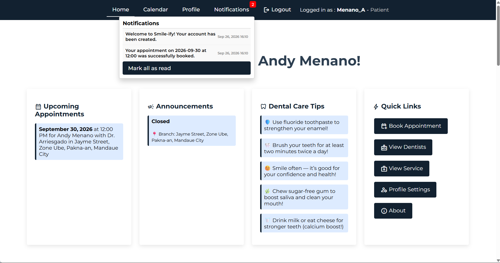
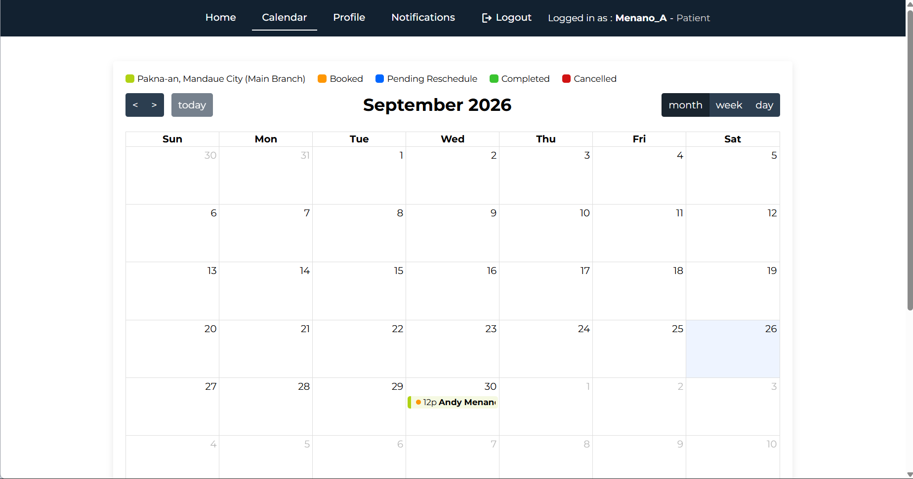
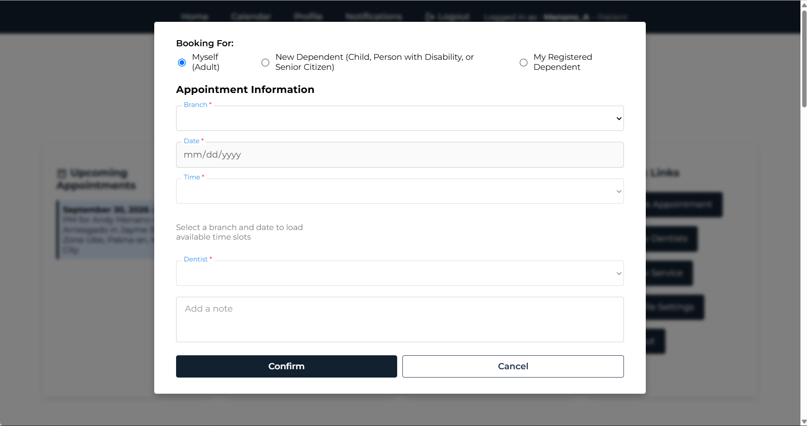

# Screenshots

# Project Overview
A 4-manned web application Capstone Project designed for Arriesgado Dental Clinic. Smile-ify is developed as a mobile responsive web application for the convenience of patiens/users for their dental needs, booking for a consultation or making a reservation for a dental procedure. Smile-ify also lets secretaries from different clinic branches to book appointments for patients, manage dental records, and track revenues. The owner can also be a user of the web app to track overall revenues from all branches.

# Tech Stacj
- HTML
- Bootstrap
- CSS
- JavaScript
- PHP
- MySQL
- JQuery

# How to access the web app:
Go to https://smile-ify.dcism.org/ 